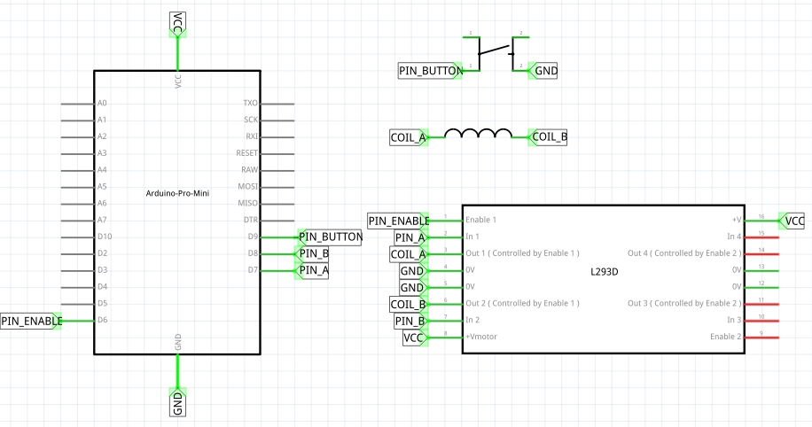
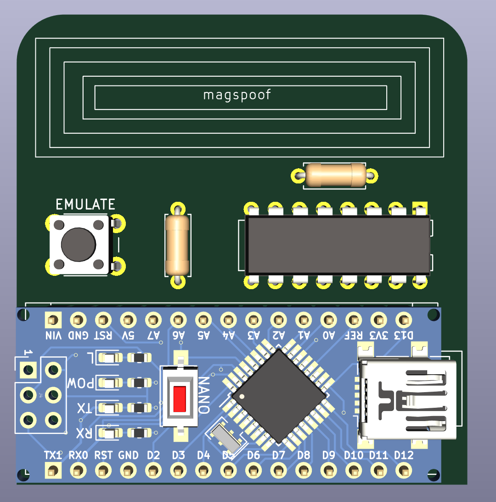

# magspoof with Arduino Nano
Arduino magnetic card emulator track 1 and track 2

Components:
- L293D
- Arduino Nano
- COIL from 24awg wire, ~50 turns on 3cm diametar

Original: https://github.com/samyk/magspoof
