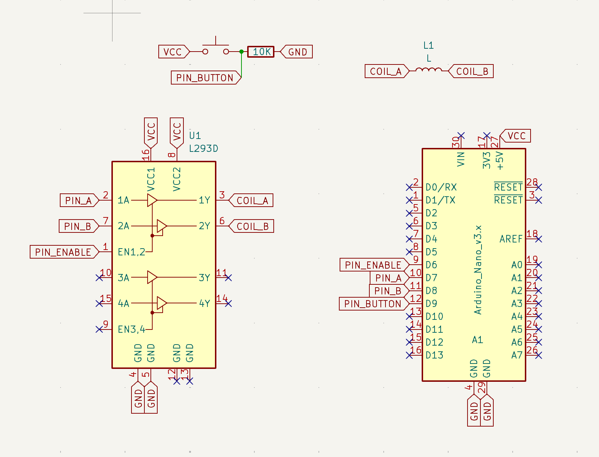

# Magspoof with Arduino Nano
Arduino magnetic card emulator track 1 and track 2

Components:
- L293D
- Arduino Nano
- COIL from 24awg wire, ~50 turns on 3cm diametar

Original: https://github.com/samyk/magspoof

## PCB Design

**Huge thanks to [PCBWay](https://pcbway.com) for sponsoring this project!**

PCBWay is a leading provider of high-quality printed circuit boards (PCBs), offering reliable and affordable solutions for both hobbyists and professionals. Their services include rapid prototyping, PCB assembly, instant online quotations, expert design verification, and a streamlined ordering experience.

Their comprehensive range of services includes:
- PCB prototyping
- Assembly services
- Instant online quotations
- Expert design verification
- A streamlined, user-friendly ordering system

